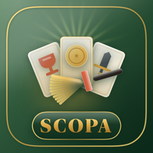
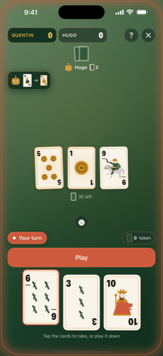
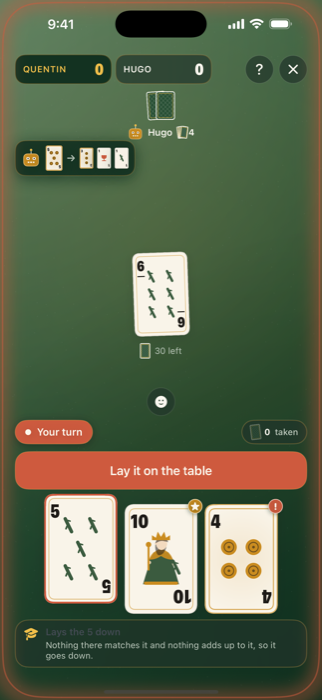
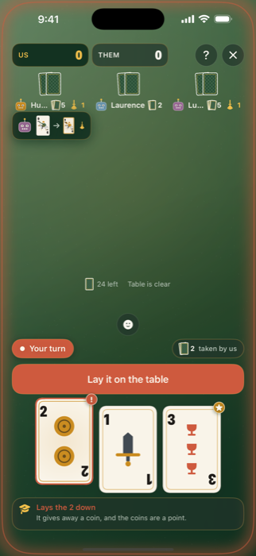
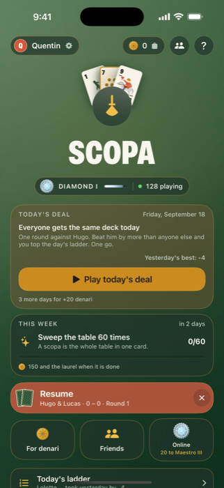
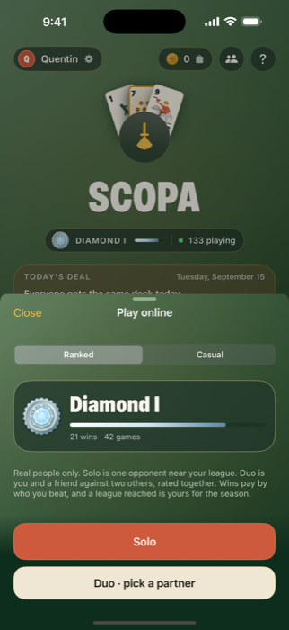
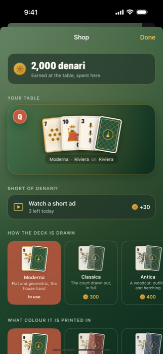
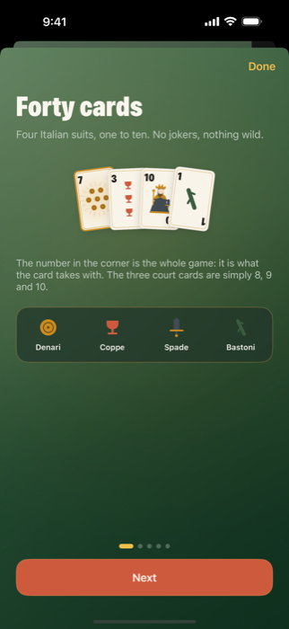

<p align="center">
  
</p>

<h1 align="center">Scopa</h1>

<p align="center">
  <b>The Italian card game, made for iPhone and iPad.</b><br>
  Play the bots, pass the phone around the table, link up with nearby phones,<br>
  or climb a monthly ranked ladder online.
</p>

<p align="center">
  <a href="https://github.com/quentinved/scopa/actions/workflows/ci.yml"></a>
  
  
  
  
  
</p>

<p align="center">
  
  
  
  
</p>
<p align="center">
  
  
  
</p>

## About

Scopa ("broom") is the classic Italian fishing card game: capture cards from the table
whose values add up to the card you play, and sweep the table clean for a *scopa*. This
is a native iOS version built with Swift 6 and SwiftUI. The game logic lives in
dependency-free Swift packages, and a small Cloudflare Worker handles the online parts.

## Features

- **Classic rules** for two, three or four players, with teams at four.
- **Three bot levels.** Every level sees only what a player in that chair would see; the
  hard one samples the unseen cards and plays the round out.
- **A coach** that explains moves as they happen, and a post-game review that grades every move.
- **Local play:** hot-seat on one phone, or nearby phones over Multipeer Connectivity.
- **Online play** over Game Center, plus four-letter room codes for tables that wait for a
  friend to arrive.
- **Daily deal, weekly challenges and ranked seasons.** Everyone plays the same cards each
  day, and a monthly season has leagues and divisions.
- **Denari**, an in-game currency earned by playing and spent on card styles, cloths and
  reactions. No real-money purchases.
- **Twelve Game Center achievements**, three languages (English, French, Italian), and all
  music and sound effects synthesised from code.

## Tech stack

| Area | Built with |
|---|---|
| App | Swift 6, SwiftUI, iOS 17+ |
| Game logic | Swift packages with no UIKit or SwiftUI, hexagonal architecture |
| Multiplayer | Game Center (GKMatch), Multipeer Connectivity, WebSocket rooms |
| Backend | Cloudflare Workers, D1 (SQLite), Durable Objects |
| Audio | Music and SFX synthesised in Python (`Tools/SoundForge`) |
| CI | GitHub Actions: package tests, Worker tests, app build |

## Layout

```
Scopa/                 App shell: screens, design system, audio, ads, shop
Packages/Scopa/        Swift packages, no UIKit or SwiftUI
  ScopaCore/Domain       Cards, rules, scoring, bots, search, coach, review
  ScopaCore/Application  Host coordinator, guest client, table updates, transport port
  ScopaRewards           Denari ledger, purse, stakes, shop items
  ScopaMultipeer         GameTransport over Multipeer Connectivity
  ScopaGameCenter        GameTransport over GKMatch, identity, achievements
  ScopaRelay             GameTransport over WebSocket rooms on the Worker
Server/                Cloudflare Worker + D1: ladder, daily deal, rooms, identity checks
Tools/                 Build script, sound synthesis, icon and achievement renderers,
                       App Store Connect uploads
```

The packages follow a hexagonal layout. `ScopaCore/Domain` is pure functions over value
types: `Rules` validates and applies a move, `Scoring` settles a round, `Search` is the
hard bot. `ScopaCore/Application` runs a table: a `HostCoordinator` owns the authoritative
`GameState` and sends each seat its own `PlayerView`, and a `GuestClient` mirrors one seat.
Both talk through the `GameTransport` port, so the same coordinator drives a hot-seat
game, a Multipeer game, a Game Center match and a relay room. The app in `Scopa/` only
ever sees `TableUpdate` values.

The Worker verifies Game Center signatures itself, so a result is only ever recorded for
the player who made it. The app works fully offline; the Worker only adds comparison.

## Building

Open `Scopa.xcodeproj` and run the `Scopa` scheme, or from the command line:

```sh
./Tools/dev.sh build                             # compile
./Tools/dev.sh run -noGameCenter -denari 99999   # build, install, launch on the simulator
./Tools/dev.sh shot out.png 12 -shop             # the above, then a screenshot
```

`dev.sh` serialises builds and simulator use behind a lock, so several sessions on one
machine queue instead of colliding, and shares one DerivedData so builds stay incremental.

Launch arguments such as `-noGameCenter`, `-denari`, `-shop` and `-autoPlay` are read
by `Scopa/Game/DebugLaunch.swift` and only exist in debug builds.

## Tests

```sh
cd Packages/Scopa && swift test     # rules, bots, coach, review, networking, rewards
cd Server && npm test               # ranking, seasons, identity verification
```

The bot tests deal the same cards to two levels and check the stronger one wins more, so a
handful of hands is enough to show a real edge rather than a lucky shuffle. The network
tests run a host and several guests over an in-process loopback transport. Both suites run
on every push, along with a build of the app, through the workflow in `.github/workflows`.

## Continuous integration and releases

| Workflow | Runs on | Does |
|---|---|---|
| [CI](.github/workflows/ci.yml) | every push and pull request | Package tests, Worker tests, app build |
| [TestFlight](.github/workflows/testflight.yml) | a `v*` tag, or by hand | Archives, signs in the cloud, uploads to App Store Connect |
| [Deploy Worker](.github/workflows/deploy-worker.yml) | by hand only | Tests, optionally applies one D1 migration, deploys |

The release workflows read their credentials from the `production` environment's secrets:
`ASC_KEY_P8` (the contents of the .p8), `ASC_KEY_ID` and `ASC_ISSUER_ID` for TestFlight,
`CLOUDFLARE_API_TOKEN` and `CLOUDFLARE_ACCOUNT_ID` for the Worker.

### Local credentials

On a machine, the store tools (`push-metadata.sh`, `push-screenshots.sh`,
`seed-achievements.sh`) read the same App Store Connect key from a `.env` at the repo root,
kept in sync with [whisper-secrets](https://whisper.quentinvedrenne.com/docs/secrets):

```sh
npm install -g whisper-secrets
whisper-secrets join <invite link>   # asks for the passphrase once, then pulls .env
whisper-secrets pull                 # later, after a secret changed
```

`.env.whisper` is committed and maps each name to an encrypted entry on the server, with no
secret in it. `.env` and `.whisperrc` (the passphrase) stay out of git. `ASC_KEY` is the
path to the .p8, which lives outside the repo. `Tools/asc-env.sh` loads the three `ASC_*`
values; anything already exported wins.

## Server

One Worker, one D1 database, one Durable Object class for rooms. See
[Server/README.md](Server/README.md) for deploy steps. Apple API keys for the store
tooling are read from `ASC_KEY`, `ASC_KEY_ID` and `ASC_ISSUER_ID` and never stored in
the repo.

## Licence

The source is published to be read, not reused: see [LICENSE](LICENSE).
